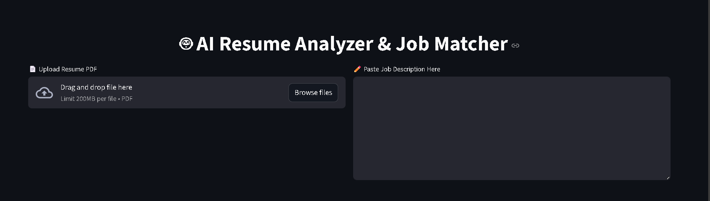
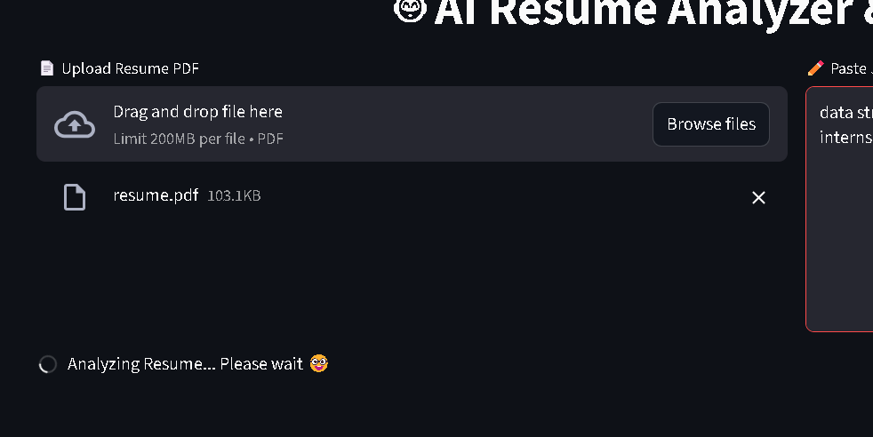
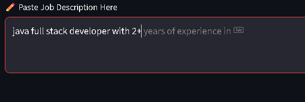
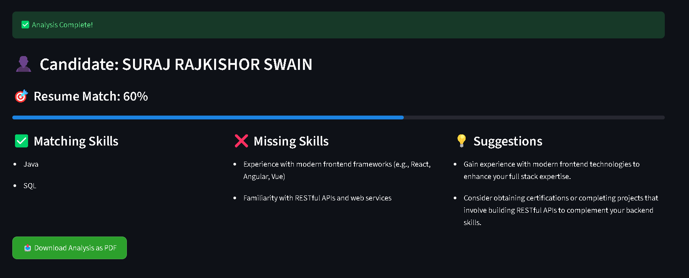

# 🤖 AI Resume Analyzer & Job Matcher

An AI-powered web application that analyzes resumes against job descriptions and provides ATS-style insights.

## 🚀 Features
- Upload resume (PDF)
- Auto-extract candidate name
- Resume–Job Description matching
- ATS match percentage
- Skill gap analysis
- Improvement suggestions
- Downloadable PDF report

## 🛠️ Tech Stack
- Python
- Streamlit
- OpenAI API
- PDF Parsing

---

## 🖼 App Screenshots

### 1️⃣ Starting Interface


### 2️⃣ Upload Resume & Job Description


### 3️⃣ Auto-Suggestion While Filling JD


### 4️⃣ Analysis Outcome & Download Button


---

## ▶️ How to Run Locally

1. Clone the repo:

```bash
git clone https://github.com/YOUR_USERNAME/ai-resume-analyzer.git
cd ai-resume-analyzer

2. Download the folder and run in desktop:

```bash
pip install -r requirements.txt
streamlit run app.py

👨‍💻 Developed By
Suraj R. Swain